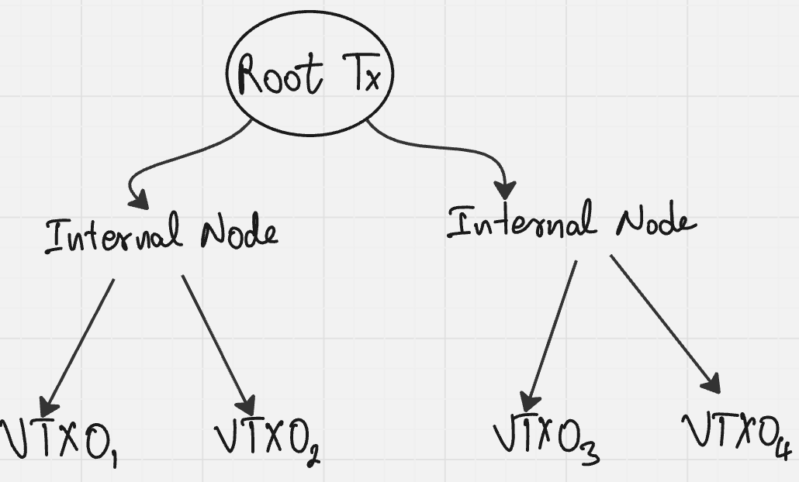

<center>
    <h1>Deepdive into Ark and Coinflip</h1>
    By: Dikshant (<A href="https://github.com/pingu-73/">pingu-73</A>)
</center>

# 1. Bitcoin
## 1.1 Fundamentals

Bitcoin is a decentralized digital currency. Unlike traditional currencies issued by central banks, Bitcoin operates on a peer-to-peer network without central authority. Its core innovation combines several technologies:

### Blockchain Technology:
At its heart, Bitcoin uses a blockchain—a distributed ledger that records all transactions across a network of computers. This ledger is:

- **Immutable:** Once recorded, data cannot be altered
- **Transparent:** All transactions are publicly viewable
- **Distributed:** Maintained by thousands of nodes worldwide

### Consensus Mechanism: 
Bitcoin uses a Proof-of-Work (PoW) consensus algorithm where "miners" compete to solve complex mathematical puzzles. The first to solve the puzzle gets to add a new block of transactions to the blockchain and receives newly minted bitcoins as a reward. This process:
- Secures the network against attacks
- Distributes new bitcoins in a predetermined manner
- Requires significant computational resources

### Cryptographic Security: 
Bitcoin employs public-key cryptography where:

- Users have a pair of cryptographic keys: a public key (shared with others) and a private key (kept secret)
- The public key generates a Bitcoin address for receiving funds
- The private key is used to sign transactions, proving ownership
- Digital signatures verify transaction authenticity without revealing private keys

## 1.2 UTXO Model
Bitcoin's accounting system differs fundamentally from traditional banking. Instead of account balances, Bitcoin uses the Unspent Transaction Output (UTXO) model:

- Every bitcoin transaction consumes existing UTXOs as inputs
- Each transaction creates new UTXOs as outputs
- your "**balance**" is the sum of UTXOs you can spend with your private keys

### Example:
If Alice has a UTXO worth of 1 BTC and want to send 0.3 BTC to Bob.
1. Alice creates a transaction that uses her 1 BTC UTXO as input
2. The transaction creates two outputs: 0.3 BTC to Bob and 0.69 BTC back to Alice (minus transaction fees)
3. Alice's original 1 BTC UTXO is now spent and no longer usable
4. Bob now controls a new 0.3 BTC UTXO, and Alice controls a new 0.7 BTC UTXO

> This model provides excellent security and privacy properties but introduces complexity in transaction construction.

## 1.3 Bitcoin Scriptiong
Bitcoin transactions aren't simply transfers of value—they're programs. Each UTXO is locked by a script that defines the conditions under which it can be spent.

Script Types:
- **P2PKH (Pay to Public Key Hash):** The most common script type, requiring a signature from the owner's private key
- **P2SH (Pay to Script Hash):** Allows more complex spending conditions
- **P2MS (Pay to Multisig):** Requires M-of-N signatures from different keys
- **P2TR (Pay to Taproot):** A newer script type enabling more complex conditions with better privacy
- **P2WSH (pay to witness script hash), etc**

**Script Execution:** Bitcoin's script is a simple stack-based language. When spending a UTXO, the spender provides data (like signatures) that, when combined with the locking script, should evaluate to "true" to be valid.

## 1.4 Bitcoin Limitations
### Throughput Constraints:
- **Block size limit:** Approximately 1MB per block
- **Block time:** ~10 minutes between blocks
- **Transaction capacity:** ~3-7 transactions per second (compared to Visa's ~1,700 TPS)

### Fee Market Dynamics:
- Limited block space creates competition among transactions
- Users bid for inclusion via transaction fees
- During high demand, fees can spike dramatically

### Confirmation Latency:
- Transactions typically require multiple confirmations for security
- Each confirmation takes ~10 minutes on average
- Practical settlement time: 30-60 minutes for high-value transactions

> These limitations create a fundamental tension between Bitcoin's security, decentralization, and scalability often called the "Blockchain Trilemma."
 
------
------

# 2. Scaling Solutions: The Need for Layer 2
## 2.1 The Scaling Debate
### On-Chain Scaling Approach:
- Increase block size to accommodate more transactions
- Criticized for increasing resource requirements for node operators
- Led to contentious forks like Bitcoin Cash

### Off-Chain Scaling Approach:
- Keep base layer conservative and build additional layers on top
- Preserve decentralization and security at the base layer
- Develop "**Layer 2**" solutions for everyday transactions

> The Bitcoin community has largely embraced the off-chain scaling approach, leading to the development of various Layer 2 solutions.

## 2.2 Lightning Network: The First Major Layer 2 Solution
The Lightning Network emerged as Bitcoin's primary scaling solution, designed to enable:

- Near-instant transactions
- Negligible fees
- Massive scalability potential

### Architecture:
Lightning operates through payment channels—bilateral connections between users that allow multiple transactions without touching the blockchain:
1. **Channel Opening:** Two parties create an on-chain transaction that locks funds into a 2-of-2 multisignature address
2. **Off-Chain Transactions:** Parties exchange signed transactions that redistribute the channel balance
3. **Channel Closing:** Either party broadcasts the latest state to the blockchain, releasing funds according to the final balance

#### Network Effect: '
Individual payment channels connect to form a network where payments can route through multiple channels:

- Alice can pay Dave without a direct channel if paths exist (e.g., Alice→Bob→Charlie→Dave)
- This creates a network effect where each new channel increases overall connectivity

### Challenges: 
Despite its elegant design, Lightning faces several challenges:
- **Liquidity Constraints:** Channels require pre-allocated funds
- **Routing Complexity:** Finding optimal payment paths is non-trivial
- **Online Requirement:** Recipients must be online to receive payments
- **Channel Management:** Users must actively monitor channels to prevent fraud

## 2.3 The Need for Alternative Layer 2 Solutions
While Lightning Network addresses many scaling issues, certain use cases remain challenging:

- **Large Payments:** Lightning works best for small to medium transactions
- **Custody Solutions:** Institutional needs for managed funds
- **Complex Applications:** Smart contract functionality beyond simple payments
- **User Experience:** Technical complexity for average users

> These limitations have driven the development of complementary Layer 2 solutions, including the Ark protocol.

------
-----

# 3. Ark Protocol: A Technical Deep Dive
## 3.1 Ark's Design Philosophy
Ark represents a novel approach to Bitcoin scaling with different trade-offs than Lightning:

**Core Principles:**

- **Batching Efficiency:** Aggregate many transactions into single on-chain footprints
- **Unilateral Exit Rights:** Users maintain sovereignty over their funds
- **Familiar UTXO Model:** Preserve Bitcoin's ownership model in a virtual space
- **Minimal Trust Assumptions:** Reduce reliance on third parties

**Comparison to Lightning:**

- **Lightning:** Peer-to-peer channels requiring bilateral cooperation
- **Ark:** Coordinated batching with unilateral exit guarantees

## 3.2 Ark's Core Components
### 3.2.1 Virtual Transaction Outputs (VTXOs)
The fundamental innovation in Ark is the VTXO—a virtual representation of a Bitcoin UTXO:
```
VTXO = {
  owner_pubkey: XOnlyPublicKey,
  server_pubkey: XOnlyPublicKey,
  amount: u64,
  exit_delay: u16,  // Relative timelock in blocks
  tapscripts: Vec<TapScript>
}
```

Each VTXO is secured by a Taproot output with two key spending paths:

1. **Collaborative Path:** `<owner_pubkey> CHECKSIGVERIFY <server_pubkey> CHECKSIG`
2. **Exit Path:** `<delay> CHECKSEQUENCEVERIFY DROP <owner_pubkey> CHECKSIG`

This script structure ensures that:

- The owner and server can cooperatively spend the VTXO instantly
- The owner can unilaterally withdraw after a timelock period (typically 24 hours)
- No party can freeze funds permanently

### 3.2.2
VTXOs are organized in binary Merkle trees to enable efficient batching:

**Tree Structure**



**Technical Implementation:**

- Each node in the tree is a fully signed Bitcoin transaction
- The root transaction spends a shared output created by the Ark Server
- Internal nodes split outputs into two child outputs
- Leaf nodes create individual VTXOs

This tree structure allows:
- Efficient proof of inclusion for individual VTXOs
- Compact representation of many outputs
- Selective revelation of branches for exits

### 3.2.3 Shared Outputs
The Shared Output is the on-chain anchor for a VTXO tree:

Script Structure:
```
// Taproot output with two spending paths
1. Unroll Path: Used to reveal the VTXO tree
2. Sweep Path: Allows server reclamation after expiry
```

Technical Implementation:
```
shared_output_script = Taproot(
  internal_key: H,  // Unspendable key
  scripts: [
    // Unroll path - reveals VTXO tree
    <user1_pk> CHECKSIGVERIFY <user2_pk> CHECKSIGVERIFY ... <server_pk> CHECKSIG,
    
    // Sweep path - server reclaims after expiry
    <expiry_time> CHECKLOCKTIMEVERIFY DROP <server_pk> CHECKSIG
  ]
)
```

## 3.3 Ark Transaction Lifecycle
### 3.3.1 Boarding Process
The boarding process allows users to enter the Ark system:

**Technical Flow:**

1. User creates a boarding output with script:
```
<timeout> CHECKLOCKTIMEVERIFY DROP <user_pubkey> CHECKSIG
<user_pubkey> CHECKSIGVERIFY <server_pubkey> CHECKSIG
```
2. User registers the boarding output with the Ark Server

3. Server includes the boarding output in the next round transaction

4. User receives a VTXO in the new VTXO tree

### 3.3.2 Off-chain Transactions
Users can transact with VTXOs without touching the blockchain:

**Redeem Transaction Process:**

1. Sender creates a transaction spending their VTXO:
```
inputs: [sender_vtxo]
outputs: [
  {recipient_address, amount},
  {sender_address, change_amount}  // if needed
]
```
2. Sender signs the transaction using the collaborative path

3. Server co-signs the transaction

4. Transaction is complete and recipient can immediately spend the received VTXO

This process enables:

- Instant settlements
- Negligible fees
- High transaction throughput

### 3.3.3 Round Transactions
Round transactions are periodic on-chain settlements that:

- Create new VTXO trees
- Refresh expiring VTXOs
- Allow users to join or exit the system

**Technical Implementation:**
```
round_tx = {
  inputs: [server_utxos, boarding_outputs],
  outputs: [
    shared_output,  // Commits to new VTXO tree
    connector_output,  // Commits to connector tree
    change_output,  // Server's change
    exit_outputs  // For users exiting to on-chain
  ]
}
```

### 3.3.4 Forfeit Transactions
Forfeit transactions enable atomic swaps between old and new VTXOs:

**Technical Flow:**

1. Server creates a round transaction with connectors
2. User creates a forfeit transaction:
```
inputs: [user_vtxo, connector]
outputs: [server_address]
```
4. User signs the forfeit transaction
5. Server broadcasts the round transaction
6. Forfeit transaction becomes valid only after round confirmation

> This mechanism ensures that users don't lose funds when refreshing VTXOs.

### 3.3.5 Unilateral Exit
If the server becomes unresponsive, users can exit unilaterally:

**Technical Process:**

1. User broadcasts the branch of the VTXO tree leading to their VTXO
2. Once confirmed, the user waits for the timelock to expire (typically 24 hours)
3. User can then spend the funds freely

> This exit mechanism guarantees user sovereignty over funds without requiring server cooperation.

## 3.4 Ark's Security Model
Ark's security relies on several cryptographic mechanisms:

**Timelocked Scripts:**

- Exit paths use CSV (CheckSequenceVerify) to enforce waiting periods
- Sweep paths use CLTV (CheckLockTimeVerify) to enforce batch expiry

**Pre-signed Transactions:**

- All transactions in the VTXO tree are fully signed
- Users possess complete exit paths at all times

**Connector Mechanism:**

- Connectors create cryptographic dependencies between transactions
- Prevent double-spending attempts during round transitions

**Batch Expiry:**

- Each batch has a defined lifetime
- Users must refresh VTXOs before expiry
- Server can reclaim liquidity from expired batches

## 3.5 Ark's Benefits and Trade-offs
**Benefits:**

- **Scalability:** Thousands of transactions in a single on-chain footprint
- **Cost Efficiency:** Amortizes on-chain fees across many transactions
- **Sovereignty:** Users maintain unilateral exit rights
- **Simplicity:** Familiar UTXO model with minimal complexity

**Trade-offs:**

- **Liveness Requirement:** Users must refresh VTXOs before expiry
- **Server Dependency:** Requires an operational server for optimal experience
- **Liquidity Costs:** Server must provide liquidity for batching
- **Exit Costs:** Unilateral exits can be expensive during high fee periods

----
----
# 4. Zero-Collateral Lotteries: Trustless Randomness on Bitcoin
## 4.1 The Challenge of Randomness in Blockchain
Creating fair, unpredictable randomness on deterministic blockchains presents unique challenges:

- Blockchain transactions are deterministic by design
- Miners can potentially manipulate transaction inclusion
- Participants may abort protocols when outcomes are unfavorable

Traditional approaches require:

- Trusted third parties (compromising trustlessness)
- Large security deposits (creating capital inefficiency)
- Complex multi-party computation (increasing complexity)

## 4.2 CoinFlip Protocol
The "Zero-Collateral Lotteries in Bitcoin and Ethereum" paper by Miller and Bentov introduces an elegant solution:

**Core Innovation:** A protocol that enables fair coin flips without requiring participants to lock up collateral, using a commitment scheme with forced opening.

### 4.2.1 Protocol Overview
**Participants:**

- Alice and Bob want to bet on a fair coin flip
- Neither trusts the other to be honest

**High-level Process:**

1. Both parties commit to random values
2. Both parties reveal their commitments
3. The coin flip result is determined by combining their random values
4. If either party attempts to abort, the other can claim all funds

### 4.2.2 Technical Implementation on Bitcoin
The Bitcoin implementation uses a series of carefully crafted transactions:

**Setup Phase:**
```
// Alice creates and signs a funding transaction
txFund = Transaction {
  inputs: [Alice's UTXO],
  outputs: [2-of-2 multisig(Alice, Bob)]
}
```

**Commitment Phase:**
```
// Alice creates and signs a commitment transaction
txCommit = Transaction {
  inputs: [txFund.output[0]],
  outputs: [
    // Output 0: Alice's commitment with timelock
    P2SH(IF <timelock> CHECKSEQUENCEVERIFY DROP <Alice_pubkey> ELSE <commitment_hash> ENDIF),
    // Output 1: Bob's stake
    P2PKH(Bob_pubkey)
  ]
}
```

**Reveal Phase:**
```
// Alice reveals her commitment
txReveal = Transaction {
  inputs: [txCommit.output[0]],
  outputs: [P2PKH(Alice_pubkey)],
  witness: [Alice_sig, Alice_random_value, Alice_nonce]
}
```

**Timeout Handling:**
```
// Bob can claim funds if Alice doesn't reveal
txTimeout = Transaction {
  inputs: [txCommit.output[0]],
  outputs: [P2PKH(Bob_pubkey)],
  witness: [Bob_sig],
  nLockTime: <timelock>
}
```

**Result Determination:** The final result is computed by combining both revealed values:
```
result = H(Alice_random_value XOR Bob_random_value)
```
Where H is a cryptographic hash function

### 4.2.3 Cryptographic Foundations
The protocol relies on several cryptographic primitives:

**Commitment Scheme:**

- A commitment is a value that hides a secret but can later be verified
- Implemented as: `commitment = H(random_value || nonce)`
- Properties: binding (cannot change the committed value) and hiding (cannot determine the value from the commitment)

**Timelock Mechanisms:**

- Relative timelocks (CSV) enforce sequential revelation
- Absolute timelocks (CLTV) set deadlines for protocol stages

**Script Puzzles:**

- Bitcoin scripts verify that revealed values match commitments
- Example verification: `OP_HASH256 <commitment_hash> OP_EQUALVERIFY`

## 4.3 Security Analysis
The protocol's security relies on several key mechanisms:

**Preventing Premature Aborts:**

- If Alice commits but doesn't reveal, Bob can claim all funds after the timelock
- This creates a financial incentive to complete the protocol

**Ensuring Fair Revelation:**

- Both parties must commit before either reveals
- Neither can bias the outcome based on the other's choice

**Handling Network Failures:**

- Timelocks provide sufficient time for transaction propagation
- Participants can recover funds even if counterparties disappear

**Miner Manipulation Resistance:**

- The protocol is resistant to miner manipulation
- Even if miners censor transactions, funds remain recoverable

## 4.4 Applications Beyond Gambling
While presented as a lottery protocol, the technique enables broader applications:

**Decentralized Random Beacons:**

- Generate verifiable random numbers for blockchain applications
- Enable fair leader selection in consensus protocols

**Fair Resource Allocation:**

- Distribute limited resources without central authorities
- Prevent gaming of allocation systems

**Secure Multiparty Computation:**

- Building block for more complex cryptographic protocols
- Enable privacy-preserving computations between untrusting parties

---
---
# 5. Technical Comparison: Ark vs. Lightning vs. Zero-Collateral Lotteries
## 5.1 Architectural Approaches
#### Lightning Network:

- **Model:** Peer-to-peer payment channels
- **Topology:** Network of bilateral channels
- **State Management:** Channel state updates via mutual signatures
- **Settlement:** Cooperative or unilateral channel closures

#### Ark Protocol:

- **Model:** Coordinated batching with unilateral exit rights
- **Topology:** Hub-and-spoke with central coordinator
- **State Management:** VTXOs with collaborative spending paths
- **Settlement:** Periodic round transactions or unilateral exits

#### Coinflip Protocol

- **Model:** Commitment-reveal protocol with abort penalties
- **Topology:** Direct bilateral interaction
- **State Management:** Transaction chain with timelocks
- **Settlement:** Reveal transactions or timeout claims

## 5.2 Technical Trade-offs
#### Lightning Network:

- **Strengths:** Fully peer-to-peer, no coordinator, unlimited channel lifetime
- **Weaknesses:** Liquidity management, routing complexity, online requirement

#### Ark Protocol:

- **Strengths:** Efficient batching, simpler user experience, offline receiving
- **Weaknesses:** Reliance on coordinator, periodic refresh requirement, batch expiry

#### Zero-Collateral Lotteries:

- **Strengths:** Minimal trust assumptions, guaranteed fairness, no collateral
- **Weaknesses:** Limited to specific use cases, complex transaction chain, higher on-chain footprint

## 5.3 Script and Transaction Complexity
#### Lightning Network:
```
// Lightning channel funding output
2-of-2 multisig(Alice, Bob)

// Lightning commitment transaction output (simplified)
IF
  <revocation_key> CHECKSIG
ELSE
  <timeout> CHECKSEQUENCEVERIFY DROP
  <Alice_pubkey> CHECKSIG
ENDIF
```

#### Ark Protocol:
```
// VTXO script (simplified)
<owner_pubkey> CHECKSIGVERIFY <server_pubkey> CHECKSIG
OR
<delay> CHECKSEQUENCEVERIFY DROP <owner_pubkey> CHECKSIG

// Shared output script (simplified)
<unroll_script> OR <expiry_time> CHECKLOCKTIMEVERIFY DROP <server_pubkey> CHECKSIG
```

#### Coinflip Protocol/Zero-Collateral Lotteries:
```
// Commitment output script (simplified)
IF 
  <timelock> CHECKSEQUENCEVERIFY DROP <participant_pubkey> CHECKSIG
ELSE 
  <commitment_hash> EQUALVERIFY <counterparty_pubkey> CHECKSIG
ENDIF
```

---
---
# Practical Implications for Bitcoin's Ecosystem
## 6.1 Complementary Scaling Solutions
These protocols represent complementary approaches to Bitcoin scaling:

#### Lightning Network:

- Ideal for frequent, small-value payments between regular counterparties
- Well-suited for micropayments and streaming money applications
- Established infrastructure with growing adoption

#### Ark Protocol:

- Optimal for occasional payments to diverse recipients
- Well-suited for wallet services and custodial applications
- Provides better UX for less technical users

#### Zero-Collateral Lotteries:

- Specialized solution for fair randomness and game-theoretic applications
- Enables new classes of trustless applications on Bitcoin
- Demonstrates Bitcoin's programmability beyond simple transfers

> Together, these solutions form a layered scaling approach that preserves Bitcoin's security while expanding its capabilities.

## 6.2 Technical Implementation Challenges
Implementing these protocols presents several challenges:

#### Script Limitations:

- Bitcoin's script language is intentionally limited
- Complex protocols require careful design within constraints
- Script size limits affect implementation options

#### Fee Variability:

- Bitcoin's fee market creates unpredictable costs
- Protocols must account for fee spikes during congestion
- Economic incentives must remain valid across fee environments

#### Security Verification:

- Formal verification of complex protocols is difficult
- Edge cases and attack vectors require thorough analysis
- Real-world implementations may differ from theoretical models

## 6.3 Future Development Directions
These protocols point to several promising development directions:

#### Cross-Protocol Interoperability:

- Lightning channels funded from Ark VTXOs
- Zero-collateral randomness feeding into other protocols
- Seamless user experience across scaling solutions

#### Enhanced Privacy Features:

- Improved transaction privacy through CoinJoin-like batching
- Confidential transactions for amount privacy
- Enhanced metadata protection

#### Smart Contract Capabilities:

- More complex conditional logic in Layer 2 protocols
- Covenant-like restrictions without changing Bitcoin's base layer
- Application-specific protocols for different use cases

